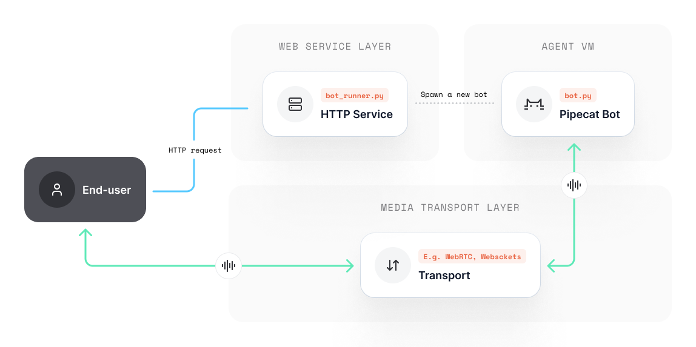

# Basic Deployment Pattern


## Project Structure

A Pipecat project will often consist of the following:

- **A bot file**, e.g. `bot.py` - A scoped Pipecat bot, containing all the pipelines that you want to run in order to communicate with an end-user. A bot file may take some command line arguments, such as a transport URL and configuration.
- **A runner**, e.g. `bot_runner.py` — A basic HTTP service that listens for incoming user requests and spawns the relevant bot file in response.

*Please note: you can call these files whatever you like! We use `bot.py` and `bot_runner.py` for simplicity.*

---

## Bot Runner

HTTP service, providing a gateway for spawning bots:



The anatomy of a bot runner service is arbitrary and dependant on your use-case, but at very least will have a method that spawns a new bot agent, for example:

```python
import uvicorn

from fastapi import FastAPI, Request, HTTPException
from fastapi.responses import JSONResponse

app = FastAPI()

@app.post("/start_bot")
async def start_bot(request: Request) -> JSONResponse:
    # ... handle / authenticate the request
    # ... provision the transport session
    
    # Spawn a new bot process
    try:
       #... create a new bot instance
    except Exception as e:
        raise HTTPException(
            status_code=500, detail=f"Failed to start bot: {e}")
            
    # Return the room URL and token to the user
    return JSONResponse({...})

if __name__ == "__main__":
    uvicorn.run(
        "bot_runner:app",
        host="0.0.0.0",
        port=7860
    )

```

Here, we listen for incoming user requests or webhook, hoist the session (such as creating rooms on your transport provider), instantiate a new bot agent and return some JSON to a user.


### Data transport

Your [transport layer](/docs/category/transports) is responsible for sending and receiving media data over the internet.

You will have implemented a transport layer as part of your `bot.py` pipeline. This may be a service that you want to host and include in your deployment, or it may be a third-party service waiting for peers to connect (such as [Daily](https://www.daily.co).)

For this example, we will make use of Daily’s WebRTC transport. This will mean that our `bot_runner.py`  will need to do some configuration when it spawns a new bot:

1. Create and configure a new Daily room for the session to take place in.
2. Issue both the bot and the user an authentication token to join the session.

Whatever you use for your transport layer, you’ll likely need to setup some environmental variables and run some custom code before spawning the agent.


### Best practice for bot files

A good pattern to work to is the assumption that your `bot.py` is an encapsulated entity and does not have any knowledge of the `bot_runner.py`. You should provide the bot everything it needs to operate during instantiation.

Sticking to this approach helps keep things simple and makes it easier to step through debugging (if the bot launched, you know to look for errors in your bot file.) 

### Showing a web UI

If you’re not using phone numbers to talk to your bot, you may want to serve a user interface. You could optionally serve static files at the root directory of your `bot_runner.py`, but we recommend keeping this separate so you have less to debug later and your container is kept light.

For the purposes of being feature complete in this documentation, we’ll include simple static file serving so that we only need to containerize and deploy a single project.

---

## Example

As a first step, let's create a `bot_runner.py` that:

- Creates an API for users
- Launches a bot as a subprocess
- Serves a static web frontend for the user to interact with

A full example of this code can be found in the [examples folder](https://github.com/pipecat-ai/pipecat/tree/main/examples) on the pipecat repo.

`bot_runner.py`

```python
import os
import argparse
import subprocess
import atexit
from pathlib import Path
from typing import Optional

from fastapi import FastAPI, Request, HTTPException
from fastapi.middleware.cors import CORSMiddleware
from fastapi.staticfiles import StaticFiles
from fastapi.responses import FileResponse, JSONResponse

from daily_helpers import create_room, get_token, check_room_url

from dotenv import load_dotenv
load_dotenv(override=True)

# Bot sub-process dict for status reporting and concurrency control
bot_procs = {}


def cleanup():
    # Clean up function, just to be extra safe
    for proc in bot_procs.values():
        proc[0].terminate()
        proc[0].wait()


atexit.register(cleanup)

# ------------ Configuration ------------ #

MAX_SESSION_TIME = 10 * 60  # 10 minutes
BOT_CAN_IDLE = True  # Does the bot leave when there are no connected peers
REQUIRED_ENV_VARS = ['OPENAI_API_KEY', 'DAILY_API_KEY', 'ELEVENLABS_API_KEY']

# Static file config
SERVE_STATIC = False
STATIC_DIR = "web-ui/dist"
STATIC_ROUTE = "/static"
STATIC_INDEX = "index.html"

# Client UI config
USE_OPEN_MIC = True  # Can the user freely talk, or do they need to wait their turn?
USE_VIDEO = False  # Does this bot require user video?

# ----------------- API ----------------- #

app = FastAPI()

app.add_middleware(
    CORSMiddleware,
    allow_origins=["*"],
    allow_credentials=True,
    allow_methods=["*"],
    allow_headers=["*"]
)

# Optionally serve built client static files
# Note: we recommend serving your client seperate from the bot
# runner for better scalability and separation of concerns
if SERVE_STATIC:
    app.mount(STATIC_ROUTE, StaticFiles(
        directory=STATIC_DIR, html=True), name="static")

    @app.get("/{path_name:path}", response_class=FileResponse)
    async def catch_all(path_name: Optional[str] = ""):
        if path_name == "":
            return FileResponse(f"{STATIC_DIR}/{STATIC_INDEX}")
        file_path = Path(STATIC_DIR) / (path_name or "")
        if file_path.is_file():
            return file_path
        html_file_path = file_path.with_suffix(".html")
        if html_file_path.is_file():
            return FileResponse(html_file_path)

        raise HTTPException(
            status_code=404, detail="Page not found")


@app.post("/start_bot")
async def start_bot(request: Request) -> JSONResponse:
    # Use specified room URL, or create a new one if not specified
    room_url = os.getenv("DAILY_SAMPLE_ROOM_URL", None)

    if not room_url:
        try:
            room_url, sip_uri = create_room(MAX_SESSION_TIME)
        except Exception:
            raise HTTPException(
                status_code=500,
                detail="Unable to provision room")
    else:
        # Check passed room URL exists
        try:
            check_room_url(room_url)
        except Exception:
            raise HTTPException(
                status_code=500, detail=f"Room not found: {room_url}")

    # Give the agent a token to join the session
    token = get_token(room_url, MAX_SESSION_TIME)

    if not room_url or not token:
        raise HTTPException(
            status_code=500, detail=f"Failed to get token for room: {room_url}")

    # Spawn a new agent, and join the user session
    try:
        proc = subprocess.Popen(
            [
                f"python3 -m bot -u {room_url} -t {token}"
            ],
            shell=True,
            bufsize=1,
            cwd=os.path.dirname(os.path.abspath(__file__))
        )
        bot_procs[proc.pid] = (proc, room_url)
    except Exception as e:
        raise HTTPException(
            status_code=500, detail=f"Failed to start subprocess: {e}")

    # Grab a token for the user to join with
    user_token = get_token(room_url, MAX_SESSION_TIME)

    # Return the bot PID, user token, and room URL
    return JSONResponse({
        "bot_pid": proc.pid,
        "token": user_token,
        "room_url": room_url,
        # And some UI config vars
        "config": {"open_mic": USE_OPEN_MIC, "use_video": USE_VIDEO}
    })


# ----------------- Main ----------------- #

if __name__ == "__main__":
    # Check environment variables
    for env_var in REQUIRED_ENV_VARS:
        if env_var not in os.environ:
            raise Exception(f"Missing environment variable: {env_var}.")

    parser = argparse.ArgumentParser(description="Pipecat Bot Runner")
    parser.add_argument("--host", type=str,
                        default=os.getenv("HOST", "localhost"), help="Host address")
    parser.add_argument("--port", type=int,
                        default=os.getenv("PORT", 7860), help="Port number")
    parser.add_argument("--reload", action="store_true",
                        default=True, help="Reload code on change")

    config = parser.parse_args()

    try:
        import uvicorn

        uvicorn.run(
            "bot_runner:app",
            host=config.host,
            port=config.port,
            reload=config.reload
        )

    except KeyboardInterrupt:
        print("Pipecat runner shutting down...")
```

`daily_helpers.py`

Abstractions for calling Daily's REST API. You can grab this file here: []

`Dockerfile`

```shell
FROM python:3.11-bullseye

ARG DEBIAN_FRONTEND=noninteractive
ARG USE_PERSISTENT_DATA
ENV PYTHONUNBUFFERED=1
ENV NODE_MAJOR=20

# Expose FastAPI port
ENV FAST_API_PORT=7860
EXPOSE 7860

# Install system dependencies
RUN apt-get update && apt-get install --no-install-recommends -y \
    build-essential \
    git \
    ffmpeg \
    google-perftools \
    ca-certificates curl gnupg \
    && apt-get clean && rm -rf /var/lib/apt/lists/*

# Install Node.js
RUN mkdir -p /etc/apt/keyrings 
RUN curl -fsSL https://deb.nodesource.com/gpgkey/nodesource-repo.gpg.key | gpg --dearmor -o /etc/apt/keyrings/nodesource.gpg
RUN echo "deb [signed-by=/etc/apt/keyrings/nodesource.gpg] https://deb.nodesource.com/node_${NODE_MAJOR}.x nodistro main" | tee /etc/apt/sources.list.d/nodesource.list > /dev/null
RUN apt-get update && apt-get install nodejs -y

# Set up a new user named "user" with user ID 1000
RUN useradd -m -u 1000 user

# Set home to the user's home directory
ENV HOME=/home/user \
    PATH=/home/user/.local/bin:$PATH \
    PYTHONPATH=$HOME/app \
    PYTHONUNBUFFERED=1

# Switch to the "user" user
USER user

# Set the working directory to the user's home directory
WORKDIR $HOME/app

# Install Python dependencies
COPY *.py .
COPY ./requirements.txt requirements.txt
RUN pip3 install --no-cache-dir --upgrade -r requirements.txt

# Copy frontend app and build
COPY --chown=user web-ui/ web-ui/
RUN cd web-ui && npm install
RUN cd web-ui && npm run build

# Start the FastAPI server
CMD python3 bot_runner.py --host "0.0.0.0" --port ${FAST_API_PORT}
```

The bot runner and bot `requirements.txt`:
```
pipecat-ai[daily,openai,silero]
fastapi
uvicorn
requests
python-dotenv
```

And finally, let's create a `.env` file with our service keys

```
DAILY_SAMPLE_ROOM_URL=https://yourdomain.daily.co/yourroom # (optional: for joining the bot to the same room repeatedly for local dev)
DAILY_API_KEY=...
OPENAI_API_KEY=L...
ELEVENLABS_API_KEY=...
```

### How it works

Right now, this runner is spawning `bot.py` as a subprocess. When spawning the process, we pass through the transport room and token as system arguments to our bot, so it knows where to connect.

Subprocesses serve as a great way to test out your bot in the cloud without too much hassle, but depending on the size of the host machine, it will likely not hold up well under load. 

Whilst some bots are just simple operators between the transport and third-party AI services (such as OpenAI), others have somewhat CPU-intensive operations, such as running and loading VAD models, so you may find you’re only able to scale this to support up to 5-10 concurrent bots.

### Best practices

In an ideal world, we'd recommend containerizing the bot and the bot runner independently to keep the image for the bot to a bare minimum (it very likely doesn't need Node, or the static files etc.) For the sake of simplicity we're just using one container for everything.

### Build and run

We should now have a project that contains the following files:

- `bot.py`
- `bot_runner.py`
- `daily_helpers.py`
- `requirements.txt`
- `.env`
- `Dockerfile`

`docker build ...`

