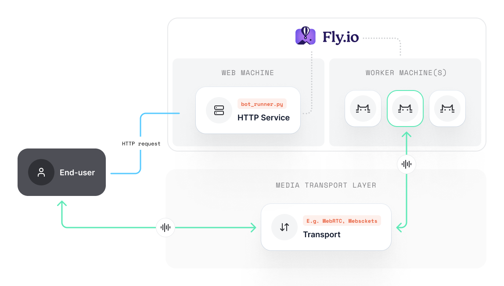

# Deploying with Fly.io

## Setup

Let's explore how we can use [fly.io](www.fly.io) to make our app scalable for production, spawning our Pipecat bots on virtual machines with their own resources. We like Fly as it provides a REST API for launching new machines, but please note that the same principles here apply to other cloud hosting providers.

We mentioned before that you would likely want to containerize the `bot_runner.py` web service and the `bot.py` separately. Fly offers a way to define different processes, so we can get away with Dockerizing everything into one deployment.



### Install the Fly CLI

You can find instructions for creating and setting up your fly account [here](https://fly.io/docs/getting-started/).

### Adding a fly.toml

Add a `fly.toml` to the root of your project directory. Here is a basic example:

```yaml
app = 'pipecat-simple-chatbot'
primary_region = 'sjc'

[build]

[http_service]
  processes = ['bot_runner']
  internal_port = 7860
  force_https = true
  auto_stop_machines = true
  auto_start_machines = true
  min_machines_running = 1

[[statics]]
  guest_path = "/web-ui/dist/assets"
  url_prefix = "/assets"

[[vm]]
  processes=['bot_runner']
  memory = '2gb'
  cpu_kind = 'shared'
  cpus = 2
```

We have defined configuration for the http service (our bot_runner), but have not yet defined any configuration for our bot VMs. We'll do that via their API when spawning the bot.

Let's test the configuration first but running `fly launch`. Once the process finishes, you should have a URL to visit so you can test talking to your bot!

---

## Spawning bots on VMs

TODO